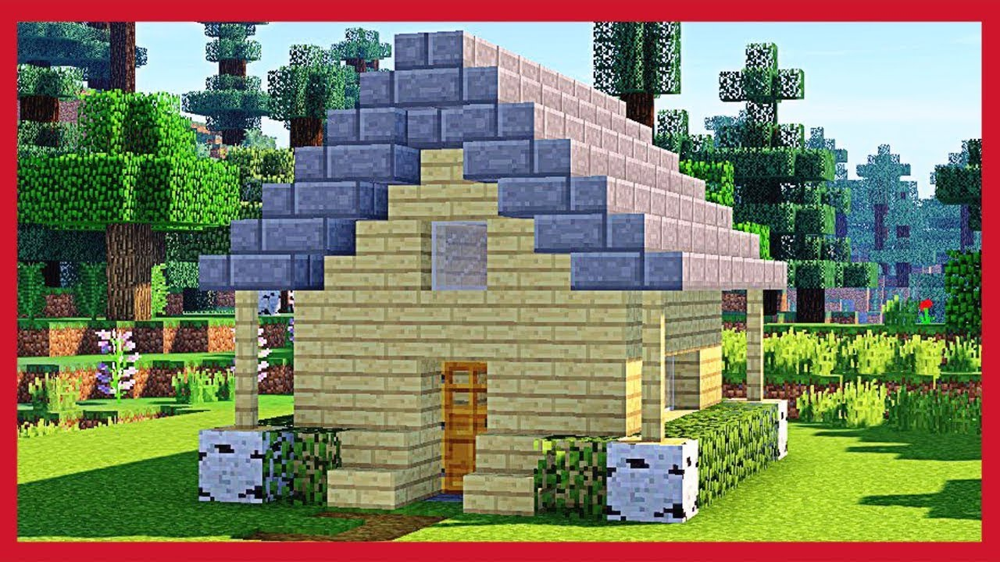

# libro

## Capitolo uno

In un paese lontano si scateno` una guerra,come si sa` da tanto le guerre su minecraft non sono pericolose, perche` si puo sempre  rinascere, ma in qesto mondo avete solo una vita. E in questo mondo ci sono persone non tanto buone, ansi direi molto cattive. Roy era una brava persona, era educato,buono,si comportava bene. Per sfortuna nei giorni,nel suo villaggio arrivo` un  sacco di gente cattiva, ma molto cattiva. Roy non poteva lasciarle che  accada qualcosa di male o di brutto al suo villaggio, quindi decise di partecipare a questa guerra. Prima di andare a combattere passo` dal suo migliore amico Wose, perche non sapeva combattere, invece Wose sapeva combattere anche bene, per questo che passo` da lui.

>«Ciao, Wose lo sapevi che verso il nostpo villaggio si sta dirigendo una guerra?» Passo` la nutizia spaventato ma seza farlo vedere a Wose»

>«Cosa?!No non lo sapevo, ok allora io mi preparo, e tu?»  Domando` Wose preparandosi alla guerra che vivra`.

>« Come? E io cosa faccio, non so` combattere!» Disse preoccupato Roy.

>«Va bene ti insegnero` a combattere Roy.» Disse Wose  preparandosi all`allenamento.

>«Grazie Wose!» Ringrazio` Roy.

Roy si alleno` tanto, e alla fine aveva finito di allenarsi. Dopo qualche giorno l` esercito di militari era gia nel villaggio. Uno dopo l` altro muoriva, Roy e Wose combattevano come dei veri guarrieri. Quando la guerra fu` finita Roy e Wose festeggiarono.
«Wose abbiamo vinto alla  gurra!!!!» Esclamo` Roy allergo.
«Si, Roy abbiamo vinto!!!!» Urlai dall`alegria Wose.
«Si, pero non credo che sia ora un posto sicuro.»   Disse Roy.
«Roy facciamo una casa ma nascosta, almeno non dovremmo cercare di proteggere un grosso villaggio, ma una piccola casetta.» Disse Wose propporendo un idea .
Dopo questa guerra i due amici partirono per  la ricerca di un postoideale per la casa. 
«Wose fa` caldo. Hai l` acqua?» chiese Roy.
«No, midispiace ma non abbiamo l`acqua.» Rispose Wose cofermando che mancava l`acqua.
«C`osaaa!!!???? Non abbiamo l`acqua ???»  Richiese Roy.
«Hai detto bene Roy, non abbiamo l`acqua» Rspose Wose.
 I giorni passavano,le ore passavano, il tempo passava , ma i due amici non trovarono niente. Finche non trovassero il bosco dagli alberi di Acacia.
 
«Hei, Wose siamo arrivati?» Chiese Roy sospirando dalla stanchezza.
«Non abbiamo trovato nessun posto ideale Roy»  Rispose Wose.
«Ma noi gia` lo stiamo cercando da uno,due,tre… insomma tonti giorni, non credi?»  Disse Roy.
Passavano tanti giorni alla fine dopo tanto Roy e Wose trvarono un villaggio anche se non era quello che cercavano, il villaggio non era grande e non tanto piccolo, insomma a loro e` piaciuto e hanno deciso di viverci. Tanti di voi qando trovate un villaggio per non fare fatica prendete le case dei villager, a loro non piacera`, avvolte non si protteggono neanche, perche non hanno una casa, stanno fuori e si lasciano mangiare dagli zombie.Ma i due amici decisero di fare una propria casa, vi chiederete perche` volevano un` po` piu compania, ciue` i villager, perche stare «soli» e` um`po` tristino, infatti io quando creo un mondo cerco sempre un villaggio.
«Ma perche` credi che sia una cattiva idea rubare una casa a un villager Wose?»  Chiese Roy.
«Dimmi perche`siamo partiti alla ricerca di un posto dove vivere?»  Riuspose Wose con un`altra domanda. 
«Mmm… perche`  non avevamo piu i nostri amici villager.»  Roy cerco` di indovinare perche`sono partiti alla ricerca di un posto dove vivire.
«Si` e perche` non avevamo piu una casa, capito Roy?»  Spiego` Wose a Roy.
Alla fine tutti e due decisero di fare  una casa per tutti e due. Loro per la casa decisero di usare il legno,la pietra,il vetro. Allinizio pensavano di  fare una casa a un piano ma dopo cambiarono idea,  pensavano prima di fare una stanza per entrambi, ma dopo decisero di fare in modo che ognuno abbia la  sua. Roy stava al piano di sopra e Wose stava sotto. Passavano giorni e giorni e la casa fu finita, non era grande perche non serve grande a loro basta  una casa piccola.

Anche io vorrei vivere la` dentro. I ragazzi ci hanno lavorato tanto per far questa casa e tanta attenzione                   per farla dritta e precisa. Wose andava a prendere la legna come un vero boscaiolo, Roy andava a comprare qualcosa di inutile dai villlager, oppure proteggeva il villaggio, nel senso che continuava il suo lungo muro di legna e pietra intorno al villaggio. Quando erano stanchi e non avevano voglia di prendere la legna,fare il muro o di comprare dai villager i ragazzi  andavano in caverna.

«E` da tanto che non ci attaccano o ci fanno qualcosa di cattivo.» Disse Roy saltendando dalla gioia.
«Non ti pare stano che da tanto non ci vogliono morti?»  Domando` Wose.
«No, ansi ne sono sicuro!»  Rispose Roy saltellando ancora.

Passo` un mese e ancora niente di strano.Wosa e Roy decisero di far una passeggiata per il villaggio di mattina, mentre passeggiavano un villager si avvicino` e gli disse che si devono salvare perche verso il loro villaggio si dirigeva uno zunami. Roy e Wose si spaventarono, Roy decise  di allungare il muro ma a Wose non sembrava una bella idea. Quindi decise  proteggere la casa, ovviamente sinche` che avevano tantissima legna decise di proteggere la casa  con il legno, invece Roy stava  ancora a costruire quel muro di legno e pitra.  Dopo un giorno il zunami era molto ma molto vicino al loro villaggio, e dopo poco tempo inizio a coprire il villaggio di Roy e Wose. Il muro di Roy ha resistito le prime trenta quatro orde dello zunami ma dopo  il zunami l`ha coperti tutto. Wose sapeva che sarebbe successo qualcosa del genere e quindi sotto il suo letto ha fatto un passaggio segreto che portava sotto terra.
Il passaggio era fatto di pietra.
«A… ecco dove e` finita tutta la  pietra, che io aavevo preso.»  ussuro` Roy tra se` stesso.
Anche se non era il posto piu bello, ci trascorsero tanti giorni aspettando che lo zunami che ha coperto il villaggio.
Passavano giorni e giorni, e dopo 28 giorni lo zunami passo`, Roy e Wose uscirono dal nascondiglio. Il villaggio era distrutto, non si vedeva  neanche un villager, di solito tutti i villager stavano fuori dalle proprie case a parlare, ma ora non c`era neanche un` anima dei villager. Cosi tanto tempo a costruire la casa e dopo buttata giu`da uno zunami, almeno la loro casa era ancora un` po` «viva», pero` anche lei era  distrutta.
«Ma come, come e` possibile di nuovo tutto distrutto!!!!!!!????»  Esclamo` Roy.
«Si` e` proprio cosi` Roy.»  Ribatte` Wose dispiaciuto.
«Allora non credi Wose che dovremmo fare una casa sotto terra?» Roy propose un`idea.
«Bella idea, se facciamo la casa sotto terra e se uno zunani ci volesse distruggere dinuvo non ci fara` niente perche` saremmo sotto terra!» Confermo` Wose felice. 
E` cosi` Roy e Wose costruissero una casa sotto terra, la casa era fatta come al solito di legno e pietra. Il pavimento era di legno e le pareti di pietra, l`boccaporto era di ferro con la leva, dentro era gia tutto pronto,il forno, i letti, le casse… grazie all` idea di Roy, Roy e Wose si salvarono da altri zunami che passavano per il loro mondo.

                                                          
«Visto Wose, io avevo ragione quando ti ho proposto quell`idea.»  Disse Roy pensando  come era geniale.
«Si, ok bravo Roy »  Rispose Wose ignorandolo um`po`.
Un giorno Roy ando` a prendere la legna, mentre prendeva la legna vide una persona, la persona era con gli occhi bianchi e il resti era uguale al corpo di Steve. Roy decise di avvicinarsi e fare amicizia, quando si  avvicino`, la peresona gli ha dato un cazzotto dall`basso in alto e gli dii un calco, in modo che lui si scontro` con la schiena addosso a un albero, poi la persona si  teletrosporto` vicino a lui, quendo apparve aveva gia una spada di diamante ed era pronto a infizzarla, pero in quel mommento Roy tiro` fuori l` ascia di ferro e parai` l`infilzo, gli un calcio in faccia e anche lui si scontro` contro un albero, pero il calcio non era troppo forte e la persona fece un salto all` indietro si fermo` a mezza strada e poi spari` nel nulla.
Dopo questo Roy ovviamente avviso` Wose di questa storia. Wose non creddette a questa storia e decise di andare a controllare. La persona non si vedeve e non si sentiva, non c`era.
«Roy ne sei certo che la persona era in questo posto?»  Domando` Wose.
«Si`, ne sono certo.»  Rispose Roy certo di se`. 
Dopo questa storia tutti e due andarono a dormire, il giorno dopo sta volta Wose ando` a prendere la legna perche` Roy aveva paura dopo quella storia, Wose invece non aveva paura perche` non credeva in questa storia, quindi ando` tranquillo a prendere la legna. Torno` di sera peche` aveva preso tanta legna, invece Roy sene stava sul divano tutto comodo a guardare su youtobe di questa persona. 
«Senti Wose, guarda il che ho trovato su Youtube!»  Roy fece vedere un video.
Il video parlava di una persona chiamata Herobrine, aveva gli occhi bianchi e il resto cioe` il corpo era di Steve, era cattiva e non era mai stanco di uccidere e di tormentare la gente.
«Wow, era cosi`? Era cosi spaventoso?»  Domando`Wose.
«Si` era proprio cosi quando l` ho visto, si ` era cosi` spaventoso.»  Rispose Roy spaventato.

                                                                                                                        

«Dobbiamo protteggertci da quel Herobrine!» Esclamo` Wose.
«Si` hai ragione Wose, e` vero.»  Confermo` Roy.
«Ma   facciamo la prottezzione? Una palla sopra di noi di vetro? E di cosa sara` fatta?»  Domandava di continuo Roy seza fermarsi.
«Questa e` una cattiva idea del globo di vetro.»  Disse Wose.
«Fai in fretta, io credo che Herbrine tornera` a provare a ucciderci Wose!»  Preuccupato Disse Roy.
«Ci provero` Roy, provero` a inventarmi qual` cosa.»  Disse Wose gia`  pensansando a un idea.
La mattina dopo Wose si era alzato molto presto a pensare a qualcosa per proteggerela loro casa o loro stessi.
«Roy! Roy! Mi sono venute delle  idee magnifiche!»  Gridava Wose dalla felicita`.
«Queste idee sono meglio del mio sogno?»Domando` Roy ancora addormentato.
«Si` sono meglio, Roy alzati.» Rispose Wose.
«Ok, ora arrivo, fammi vestire.» Disse Roy`alzandosi dal divano.
«Si` ma sbrigati Roy, io ti aspetto in cucina davanti alla carne di ieri sera.» Rispose Wose gia` andando in cucina.
«O… eccoti Roy, sei qui tieni la carne, tell`ho scaldata.»  Disse Wose a Roy ancora addormentato da ieri. 
«Di cosa mi volevi parlare Wose?»  Dommando`Roy mangiando la carne.
«Io Roy, ti volevo parlare delle idee che mi sono pssate per la testa  sta mattina.»  commento` Wose non vedendo l` ora di raccontare le sue idee.
«Vai Wose spara (parla-racconta.)» Disse Roy volendo sentire l`idee di Wose.
«Allora Roy  la prima idea e` che noi si puo` fare una casa nel Neder nascosta, la seconda e` che si puo` fare una casa dentro all`albero, invece la terza e` una casa nella montagna. Cose preferisci?»  Wose propose delle idee a Roy.
«Io non so` decidermi tra la prima e la terza. Io preferisco quella del Neder.»  Disse Roy con la voce certa.
«Ok Roy, ho capito!» Rispose Wose concordando con lui.
«Anche a me mi e` piaciuta, pero` non c`e` ne l`acqua e  ne il cibo.»  Disse Wose pensando a un idea.
«Io ho un idea per il cibo e per l`acqua, il cibo lo prendiamo da casa e per l`acqua si puo`...»  Egli non ebbi il tempo per finire la frase e subito Wose lo interrompi`.
«Prendere da casa, vero?» Disse Wose interrompedo maleducatamente Roy.
«No, e che si puo` mettere un pentolone  e da li` si puo` prendere l` acqua.»  Roy propose unaltra idea, diversa.
«A… io pesavo di andare sempre a prendere quacosaa da casa.»  Wose capi` che aveva sbagliato a pensare cosi`.
«Non fa` niente Wose.» Disse Roy.
In tanto Roy fini` di mangiare tre fette di carne di mucca, dopo questo Wose decise dinuovo di andare a prendere la legna per la base segreta nel Neder, invece Roy ando` in caverna per prendere l` opsidian che con quale verra` usato per il portale. Wose torno` a casa di sera e Roy torno` di pomeriggio, in breve tempo Roy e Wose costuirono il portale che portava nel Neder. 
«Wose ci siamo riusciti, abbiamo fatto il portale!!!»  Gridava Roy dalla felicita`.
Sinche` che era sera Wose e Roy andarono a dormire, la mattina quando Roy era ancora a dormire Wose si alzo` presto e  decise di regararli quatro diamanti, ando` in caverna per cercare i diamanti e quando era lontano da casa, scavo` due blocchi e vide Herobrine. Wose non riusciva a capire come Herobrine faceva a capire che Wose uscisse da la`, non per esempio da duecentoblocchi ma proprio li`. Comunque Wose volle` vedere se era un falzo Herbrine, ma non fu` cosi`. Quando Wose si avvicino` Herobrine li dii un calcio in faccia e lui si scontro` contro il muro. Wose capi` che lui esisteva e tiro` fuori una spada di diamante, Herobrine corse verso di lui e all`improviso  spari, mentre correva verso di lui. Apparve davanti a Wose e questa volta aveva il tridente, era pronto per ucciderlo ma Wose taglio` il tridente. Herobrine gli ha dato un cazzotto nel cuore e Wose spacco` tipo trenta blocchi con la schiena.
Wose cosi` facilmente non si fermo`, tutti e due si corsero incontro e quando erano gia` vicini Wose infilzo` la spada nel corpo, di Herobrine ed essi spari`. Con quel  tunnel che Wose aveva fatto con la chiena, Wose trovo` quatro diamanti. Quando Roy si alzo` Wose gli regalo` quatro diamanti. Roy voleva sapere cosa ha fatto Wose tutto il tempo quando lui dormiva, cosi` Wose gli racconto` di sta mattina. Ma a nessuno dei due sembrava che Herbrine fosse morto davvero, forse era una truffa.
Il pomeriggio Roy e Wose partirono per il viaggio nel Neder. L`inferno era rosso e arancione, Wose e Roy cercarono un buon posto per la base, dopo poco tempo Wose trovo` una caverna. E` li` che decisero di farci la base segreta, la caverna era difficile da notare, se la trovavano tanto la base era nascosta. Percio` era perfetto. Voi vi chiederete perche` era segreta, perche` la porta era dietro l`angolo e era dieto a due blocchi che la coprivano, in piu` la porta era fatta di ferro. Wose e Roy ci hanno messo tanto per farla, perche` era molto ma moto solida. Nella base c`erano tante cose tipo: due piani, tanti armadii, un sacco di quadri tipo sette, un tappeto, il pavimento di legno, casse, un sacco di pentoloni ripieni d`acqua… insomma era grande.
«Wose non credi che dobbiamo dormire um` po`?» Disse Roy mettendosi gia` a dormire.
Quando Roy si stava mettendo a dormire ad un tratto esplose il letto e un pezzettino della base, Roy si scontro` contro di Wose, tutti e due furono spinti dall`esplosione contro il muro. Lontano lontano sempre nel Neder in mezzo nel lago di lava si trova un castello, li` ci vive Herobrine, e` vero che prima Wose aveva infilzato la spada di diamante nella pancia, anche se l`ha fatto Herobrine era anacora vivo, invece quello che eaveva visto Roy era un clone ma combatteva lo stesso. Torgniamo al castello Herobrine, Herobrine dopo aver sentito questo botto, si alzo` e volo` in alto per vedere da dove proveniva quell`esplosione, l`esplosione proveniva da destra. Herobrine volo` verso destra alla ricerca del punto in quale si era creata questa esplosione. Dopo tanto tepo di volo, Herobrine trovo` quella caverna. Ma non trovo` subito la basa segreta ma Herobrine aveva in mente gia` un piano. Herbrine incomincio` ad alzarsi in alto tenendo il punto preciso da far esplodere. 

«BOOM!»

Con questo movimento, Herbrine fece esplodere un grande pezzo della loro base. 
«Aaaaah, esiste un modo diverso per bussare Herobrine!!!!»   Esclamo` Roy spaventato.
A Herobrine non interessava Roy ma Wose. A un tratto gli occhi di Herobrine diventarono piu` bianchi, luminosi e brillanti, dopo questo volo` verso Wose, Herobrine prese l`ascia di ferro e la lancio` verso di Wose poi Herobrine prese Wose per colletto e lo lancio` verso il muro. Herobrine era vicino a Wose e, proprio in quel momento Roy gli sparo` una freccia alle sue spalle, Herobrine si giro` e vise Roy che era pronto a spararne un`altra pero` questa volta l`ha mancato e Herobrine gli lancio` la spada in faccia.
Roy schivo` il lancio pero` la spada prese la sua spalla destra, a Herobrine non importava e giro` la testa cercando Wose, ma lui era sparito.Quando Herobrine volava lungo il muro, ma mentre volava dietro ai blocchi si sentiva un rumore strano, qualche secondo di volo e trovo` Wose nascosto tra i  blocchi. Wose gli salto` addosso e prese la spada di pietra pronto a infilzarla, ma Herobrine sposto` da sinistra a destra con la mano e, Wose si scontro`contro il muro. Ora era il turo di Roy a sofrire, Herobrine non lo vedeva e quando si` giro` vede Roy che stava portando via Wose nel portale. Herobrine stava gia` pensato a un piano, volo` verso il portale e lo incomincio` a rompere. Quando Roy lo vise rompere il portale lascio` Wose per terra pieno di botte e di sangue fresco, corse verso Herobrine con la spada di pietra, invece Herobrine scomparve e come per magia riapparvero  blocchi al loro posto. Quando apparve dietro aveva un` ascia, pero` al posto di infilzarla gli dii un cazzotto, lo fece cadere  nel fiume di lava, ma in quel mometo Wose si alzo` in piedi e in comincio` a combattere, mentre Roy prese un` ender pearl e la lancio` verso di Herobrine. Herobrine vise che una ender pearl stava per teletrasportare Roy con se`, ma questo non lo fermo`. Herobrine prese due spade e incomicio` a battersi contro di Wose. Wose invece prese l`arco e incomincio` a sparare, mentre Herobrine cercava di avvicinarsi lentamente. Per Herobrine non era un problema perche` lui sapeva volare, ma comucue qualche freccia lo prendeva, poi quando era apparso Roy Herobrine si mise tra loro due e con un` ascia teneva uccupato Roy e con un`altra teneva uccupato Wose. Dopo qualche minuto Herobrine infilzo` la sua ascia a Wose, dopo questo Wose cadde a terra, ma Roy continuo` a combattere. Roy combatteva e combatteva e dopo questo Herobrine scomparve e non riapparve piu`.  Roy si avvicino` a Wose, lo prese e lo porto` nel mondo normale. Quando si teletrasportarono Roy mise Wose sul letto e si addormento` anche lui. La mattina dopo Roy ando` a prendere la legna e vise Wose che stava gia` tornando a casa, Roy corse vero Wose e tutti e due si abbracciarono felici di essere ancora vivi.
«Wose sei vivo, sei vivo!!!!» Gridava felice Roy.
«Anche io sono selice di essere vivo!!!!» Diceva Wose molto stanco e pieno di botte di Herobrine.
Nel frattempo nel Neder Herobrine stava sul suo trono d`oro, a pensare come fare in modo che loro muoiano, percio` mando` uno dei suoi aiutanti che si chiamava Scheleton ad ucciderli. 
«Gli uccidero` mio lord.»  Disse felice Scheleton.
Allimprovviso Scheleton spari` e comparve nel mondo normale, vicino a casa loro.
«La morte arrivera` Roy e Wose.»  Disse Scheleton pensando a un piano.
Poco tempo dopo apparve anche Null. L`altro aiutante di Herobrne.
«Null ma che ci fai qua` ?»  Chiese Scheleton.
Null non gli rispose ma gli domando`. 
«Scheleton, dove vivono? Non si vedono. Non ci sono?...»  Chise Null.
«Null, loro vivono sotto terra.»  Rispose Scheleton. 
Dopo questa conversazione apparve Herobrine, Lick, Entity 303, Herobrine Harde, Bobby 1545… insomma tutti.
«E voi cosa ci fate?»  Chisero in un coro silenzioso Scheleton e Null.
«A voi non interessa!!!»  Rispose Bobby 1545 dandoli un cazzotto nella nervatura di Scheleton.
«Bobby non arrabiarti, calmati.»  Disse Herobrine Harde.
«Allora cosa dobbiamiamo fare?» Chiese Entity 303.
«Voi dovete uccidere Wose e Roy.»  Rispose Lick.
«Vi ha gia` risposto Lick.»  Disse Herobrine.
«Ma la vittima piu pericolosa e` Wose!»  Avverti` Herobrine agli altri.
Quando fu` notte le vittime cioe` Wose e Roy si addormentarono, era il momento giusto per attacarli. Lick stava nel Neder, in caso se dovessero scappare li`. Herobrine stava con l`altro Herobrine in caverna. Entity 303 con Bobby, stavano fuori dalla casa ansi sopra. Null stava dietro l`angolo della cucina. Invece Scheleton stava insieme a Entity 303 e Bobby fuori di casa. Dopo qualche oretta Roy si alzo` per andare a mangiare qualcosa in cucina. Quando Roy  si arrivo` alla cucina e prese una bistecca, si giro` e vise Null, Roy gli dii un calcio nelle parti intime e dopo aver dato il calcio, Roy ando` ad avvertire Wose. 
«Wose, Wose, c`e` Null in cucina!!!»   Urlo` Roy svegliando Wose.
«Chi!? Dove!? Come mai!?»   Chiese Wose stupito.
«Null, in cucina, non so` perche`!!!»   Rispose Roy ancora nel panico.
Dopo questa veloce e agitata discusione Roy prese l`ascia di ferro mentre Wose la spada di diamante, andarono in caverna ma purtroppo incontrarono (due loro amici) Herobrine e un`altro Herobrine che non avevano mai conosciuto. 
«E tu chi sei… ???»   Disse Roy indicando Herobrine Harde. 
«Quello e` Herobrine Harde…»    Rispose Wose. 
«Bravo… sai gia` il mio nome Wose...»   Disse Herobrine Harde.
Dopo l`ultima parola Herobrine spari` e apparve dietro la schiena di Wose e gli dii un cazzotto cosi` forte da far scontrare con Herobrine Harde. Mentre Herobrine Harde combatteva con Wose, Herobrine come sapete era una persona cattiva percio` stava strozzando Roy, Roy insisteva. Ad un tratto Roy dii un calcio nelle parti intime di Herobrine e indovinate um`po`… Herobrine cadde a terra.
«Wose abbiamo una occasione per scappare nel Neder!!!»   Grido` Roy molto forte.
Dopo queste parole i due Herobrine sorrisero inpressionante e scomparirono nel nulla. Roy e Wose scapparono nel Neder, ma quando si teletrasportarono vicino al portale si trovava Lick, Lick dopo aver visto Roy e Wose corse verso di loro con l`ascia. Roy si lancio` contro Lick e i due nemici si misero a combattere, nel frattempo ma Wose si teletrasporto` nel  mondo normale e ando` a controllare cosa c`era sopra la casa, ma era un grave errore andare ora lassu`… Fuori dalla casa c`era Bobby, Entity 303 e Scheleton. Entity 303 lancio` una TNT contro la casa di Wose e Roy, meta` della casa dei due amici esplose. Nel Neder le cose andavano ancora peggio: Lick ha evocato il Wither.
«Lick cosa fai?!?!»    domando` Roy preoccupato.
«Io ubbidisco agli ordini!!!»   Rispose Lick.
«Ma non devi ubbidire per forza, vedi... io e Wose non abbiamo ordini...»   Disse Roy.
«Fatti i affaracci tua...»    Ribbatte` Lick.
Roy infuriato corse verso Lick e anche Lick fece lo stesso, quando si trovavano gia` vicino, Roy prese la spada e la infilzo` nello stomaco di Lick subito dopo gli dii un calcio nella faccia in modo che sbattesse contro il muro, cosi` Lick muori`. Ma non era finita ne nel Neder ne nel mondo normale: nel Neder si trovava ancora i Wither che ha evocato Lick. Proprio nel momento piu` buio, piu` pauroso arrivo` Wose.
«Wose!!!!!!! Io ho ucciso Lick.»    Disse Roy.
«Io ho una brutta notizia: la nostra casa e` distrutta!!!»    Disse Wose preuccupato.
«Si, si ma ora c`e` un Viser da uccidere!!!»   Disse Roy.
Roy attacco` da destra e Wose da sinistra, cosi` tagliarono due teste ma il Wither ne ha tre. Anche se non aveva due teste poteva sempre ataccare.
Il Wither, Wose e Roy conbattevano, ma alla fine Wose taglio` la testa al Viser e lui muori`.
«Siiii!!! Abbiamo ucciso il Wither, ora possiamo tornare a casa e mangiare qual`cosa.»   Disse calmandosi Roy.
«No Roy. No. Non e` finita!!!»   Avverti` Wose.
«E perche` no?»  Chiese Roy pensando.
«Nel mondo normale c`e` Entity 303, Bobby 1545, Scheleton e Null.»   Rispose Wose pensando a un piano.
«Noooooo!!!! Altri nemici!!!!»    Grido` Roy disperato.
«Si Roy.»   Disse Wose.
Roy e Wose si teletrasportarono nel mondo normale, avevano cosi` tanta paura che non ebbiro il coraggio di uscire dalla stanza in qui c`era il portale. Ma Wose e Roy non erano dei (codardi) e quindi uscirono dalla stanza, tutta la loro casa era distrutta sopratutto da Entity 303, Bobby, 1545 invece preparava delle trappole. Roy corse verso Entity 303  ma ad un tratto il terreno sotto di lui esplose, Roy non capiva cosa succedeva ma lascio` perdere e continuo` a correre… Quando Roy era gia` vicino a Entity 303 Roy prese la spada di diamante, salto` e la inficco` nella testa di Entity 303. Entity 303 cadde a terra ma subito dopo si rialzo` in piedi e tiro` fuori la spada di diamante dalla sua testa. 
«Tu!!! Brutto, piccolo, moccioso…!!!!!»   Grido` Entity 303 infuriato.
In aiuto a Entity 303 andarono Null, Bobby 1545 e Scheleton, Roy combatteva contro Entity, invece Wose contro Bobby, Null Scheleton. Roy salto` in aria e stava per tagliare la testa a Entity, ma Entity 303 gli dii un cazzotto cosi` forte da farlo sbattere contro un albero. La faccia e la mano destra di Entity incominciarono a sanguinare molto, la mano destra di Entity stava sanguinando per la pancia di Roy invece la faccia sanguinava per la spada infilzata di Roy. Come sapete Roy e` un tipo che non si arrende facilmente, ma ne Wose, percio` Roy si alzo` in piedi prese l`arco e una freccia e la lanciai contro Entity 303. Roy colpi Entity 303 ed egli cadde a terra con la freccia inficcata nella testa. Poco dopo Entity si rialzo` in piedi prese la spada di ferro e la lancio` in testa a Roy. Entity 303 lo colpi` e lo fece cadere a terra poi si avvicino` correndo verso di lui, quando fu` vicino mise un piede sopra la testa di Roy. Ad un tratto Roy prese il piede di Entity e incomincio` a scuotere e a sbattere Entity a terra a destra e a sinistra a destra e a sinistra e cosi` tante volte. Entity 303 non capiva come Roy era cosi` potente e forte, ma Entity non poteva muorire cosi` percio` Entity 303 fece una capriola all`idietro,  quando i suoi piedi toccarono terra perse la spada e corse verso di Wose. Per Wose era gia` difficile combattere contro tre nemici ma quatro era inpossibile. Ovviamente Roy incomincio` ad aiutare Wose, ma le forze non bastavano. Ad un tratto dal bosco saltasse qualcuno (una persona) estranea seduta sopra un cavallo nero, la persona dirisse il cavallo verso Bobby 1545 in modo che il cavallo dasse  un calcio molto forte e, cosi` fu`. Il cavallo dii un calcio cosi` forte da far sbattere Bobby contro a un albero e dopo l`albero cadde su` Bobby 1545, dopo questo momento Entity 303, Null e Scheleton guardorono la persona e all`improvviso sparirono.
«Chi sei tu???!!!»   Chiese Roy.
«Io sono StoNe_BRo, e voi???»    Rispose SoNe_BRo facendo una domanda.
«Wow!!! Sembri tosto, io mi chiamo Roy.»   Rispose Roy.
«E lui chi e`???»   Chiese StoNe_BRo a Roy.
«Io sono Wose, io ho prottetto Roy per tutta la mia vita.»   Rispose Wose.
«Ok, ma e` notte e dove si trva la vostra casa???»   Chiese StoNe_BRo.
«L`ha distrutta Entity 303.»   Rispose Wose.
«Allora dormiremo fuori e domani ci occuperemo della casa ok?»   Propose Roy.
«Ok»   Accetto` StoNe_BRo.
«Va bene»   Confermo` Wose.
Tutti e tre si addormentarono sopra il fresco terreno della terra, la mattina dopo si svegliarono e incominciarono a costruire la casa e a procurare delle resurse per le loro avventure. Due o tre giorni dopo la casa fu` finita, la casa era fatta di legno, pietra, vetro e quarzo. 
«Wow ci abbiamo messo tanto ma ci siamo riusciti!!!»   Disse StoNe_BRo.
«Siamo stati bravi.»   Disse Roy.
«Non male, bello.»   Disse Wose.
«Senti StoNe_BRo da dove sei venuto e dove hai preso quel cavallo nero???»   Chiese Roy.
«Io prima vivevo in un villaggio ma sono scappato da li` perche sono arrivati un sacco di zombie e con se` hanno portato Entity 303, Bobby 1545, Herobrine Harde, Scheleton, Lick e Null.»   Rispose StoNe_BRo.
«Ed Herobrine, c`era???»   Chiese Wose.
«No, non c`era, forse era da voi…»  Disse StoNe_BRo.
«Roy tanto tepo fa` ha visto Herobrine tra gli alberi, oppure in quel momento quando io l`ho visto nella caverna.»  Disse Wose.
«Noi dovremo attacarli all`improvviso !!!»    Disse Roy.
«Sono daccordo con l`idea di Roy.»   Confermo` StoNe_BRo.
Nel Neder Herobrine e i suoi aiutanti pensavano come uccidere Roy, Wose e ora anche StoNe_BRo, Herobrine stava seduto sul suo trono fatto d`oro, ormai le forze di Herobrine erano finite, ora aveva pochi aiutanti cioe` Null, Herobrine Herde, Scheleton, Entity 303 che non si potrebbe contare ancora vivo dopo gli atacchi di Roy.  
«Mio lord… non abbiamo speranze contro di loro...»   Disse Scheleton.
«COSA HAI DETTO!?!?!?»   Esclamo` Herobrine arrabiato.
Herobrine si avvicino` a Scheleton, sinche` che Scheleton stava sul bordo della torre, Herobrine gli dii un calcio molto forte da farlo cadere nella lava.
«Allora di che cosa si stava parlando?»   Disse Herobrine come se niente fosse.
Scheleton stava affondando nella lava e stava anche bruciando, quindi erano rimasti solo in quatro: Entity 303, Null, Herobrine ed Herobrine Harde. 
«Mio lord io credo che lei non devrebbe uccidere nostri aiutanti…»   Consiglio` Null.
«Se vuoi finire nella lava continua e se no` sta` zitto!!!»   Urlo` Herobrine.
«Ok.»   Disse Null.

         

                                                                   

Nel mondo normale i ragazzi stanno gia` lavorando, Wose si trovava in caverna, Roy prendeva la legnia e StoNe_BRo esplorava il loro territorio, ricopriva la buca che aveva fatto Entity 303 e faceva un enorme muro. Nel Neder Herobrine e il suo alleato  pensavano ad un piano per ucciderli (Roy, Wose, StoNe_BRo).
« Entity 303 andate te` e Null.»   Ordino` Herobrine.
«Scoprite il loro piano e disturbate StoNe_BRo e Wose a Roy ci penso io…» Disse Herobrine creando un portale.
Entity 303 e Null si teletrasportarono proprio dietro a Roy, Roy stava abbattendo l`albero quando  dietro apparve Herobrine Harde . Nel secondo in qui cadde l`albero Herobrine Harde lo prese per la maglia e lo sollevo` in aria tenendolo per la magliae  e dopo spari`.
«Entity hai visto cosa e` successo?»   Chiese Null.
«Si`,wow!!!»   Esclamo` Entity.
Passo` tanto tempo ma Roy non tornava Wose pensava che stava prendendo tantissima  legna, invece StoNe_BRo pensavache si era perso. Nel frattempo Null e Entity hanno trovato la loro casa: in un bosco in mezzo ai cespugli e piccola, io non l`avrei mai trovata. 
«Null guarda, l`abbiamo trovata.»  Disse Entity.
«In verita` l`ho trovato io, ma va bene e` lo stesso.»   Sottolineo` Null.
«Andiamo ad scoprire i loro piani.»   Disse Entity 303.
Ora voi vi starete chiedendo dove sarebbe in questo momento Roy e ora io velo dico, Roy si trova nel Neder nel castello di Herobrine incatenato, solo, seza cibo, ma vivo! A fare la guardia c`e` Herobrine Harde.
«Herobrine Harde, liberami!!!»   Esclamo` Roy.
«E perche` dovrei?»  Disse Herobrine Harde.
«Se` no` lo faro` io!»   Esclamo` Roy.
«E come ?!?!»  Disse Herobrne Harde vantandosi.
Roy si alzo` in piedi corse verso l`avversario che prendeva la spada. Quando Roy era molto vicino a Herobrine Harde li dii un calcio cosi` forte da farlo cadere a terra e anche a prendere la spada al volo. Roy si libero` dalle catene rompendole con la spada, in una cassa vicino trovo` delle TNT e con esse fece saltare in aria il muro del coridoio, poi prese Herobrine Harde e lo lancio` nella lava. Herobrine Harde cadde fino a meta` ma si fermo` li`, dopo incomincio` a risalire sopra, quando si alzo` aveva un`altra arma: l`ascia. Allimprovviso tutti e due si teletrasportarono nel mondo normale. Roy non sapeva dove si trovava ma girandosi vise un villaggio distrutto andare a fuoco. Era il villaggio Jeresy! Il villaggio Jeresy e` il villaggio di Roy e Wose, il villaggio che e` quasi allo zunami.
«Oh mamma mia !!! E` il villaggio Jeresy non ci credo...»    Esclamo` Roy.
«Ma cosa e` quella luce la` in fondo!?!?!»    Si domando` Roy.                           
Roy si avvicino` al villaggio e vise che andava tutto a fuoco.
«Oh!!! Capperi, va a fuoco, non va` bene devo fare qualcosa!!!»    Esclamo` Roy cercando un modo per risolvere la situazione.
Avvicinandosi ancora di piu` vise che era Herobrine Harde a incendiarlo. Roy si avvicino` correndo verso il laghetto e riempi` con l`aqua un secchio. Roy comincio` a spegnere il fuoco, a un certo punto Herobrine Harde si avvicino` a Roy  e gli disse:
«Salva pure il tuo vecchio villaggio gia` stato infestato da uno zunami!»
«E` proprio quello che faro`!»   Ribatte` Roy urlando.
Roy salto` in aria, prese una spada e la infilzo` proprio nella testa del nemico. Roy fece cadere Herobrine Harde per terra con la spada infilzata nella testa, Roi scese piano per terra prese l`ascia e gli taglio` la tesra decisivamante del tutto. Rimaneva solo un problema : l`incendio, Roy comincio` a spegnere l`incendio. Nel frattempo Null e Entity spiavano i ragazzi… fu` notte e i due ragazzi dovennero rientrare in casa.
«Null vai a disturbare StoNe_BRo e a Wose ci penso io.»  Disse Entity 303.
«Ok.»  Disse Null.
Entity e Null entrarono ansi si lanciarono in casa e attacarono tutti e due come nei piani, Entity 303 dii un calcio cosi` forte da farlo scontrare contro il muro, Entity indico` con la spada Wose per infilzargliela, ma da dietro StoNe_BRo gli infilzzo` l`ascia ed Entity muori`. Null dopo aver visto questa scena scomparve e non ritorno` piu`.
«Grazie StoNe_BRo.»    Ringrazio` Wose.
«Non c`e` di che` Wose!»     Esclamo` StoNe_BRo.
 StoNe_BRo aiuto` Wose ad alzarsi e siccome` era gia` tardi i due amici andarono a dormire.

                                                       To Be Continued…

                                                                                         

Roy e` un ragazzo di 23 anni, sempre allegro, simpatico e molto sensibile.
Roy e` il migliore amico di Wose. Roy viveva in un villaggio chiamato Jeresy ma ora vive insieme a Wose,StoNe_BRo in una casetta di quarzo inmezzo al bosco.

     

                                                         

   

Wose e` un ragazzo di circa 32 anni, il suo migliore amico e` Roy anche se non lo mosra.
Wose e` un  tipo robusto, duro e um`po` severo, bravo combattente.
Wose viveva in villaggio che si chiamava Jeresy, ma per la colpa di uno zunami vive ora con Roy e StoNe_BRo in mezzo in un bosco.

                                                 

StoNe_BRo e` un ragazzo di 26 anni, StoNe_BRo e` un tipo «bravo» simpatico e buono.
StoNe_BRo ha due migliori amici: Roy e Wose, prima viveva in un villaggio che si chiamava Wersend, ma ora vive con Roy e Wose.

                                                                          

Herobrine e` il secondo personaggio piu` conosciuto da Minecraft.
Herobrine e` cattivo e non ha e non avra` mai hella sua vita della pieta`.
Herobrine pur e` un cattivo e senza pieta` ma comuncue ha un amico fidato Herobrine Harde.
Herobrine viveva e vive anche ora nel Neder ma avvolte va` anche nel mondo normale.

                                                                           

                                                             
                                                                              

Herobrine Harde e` un personaggio poco conosciuto da Minecraft.
Herobrine Harde e` cattivo e non ha e ne avra mai la pieta`.
Herobrine Harde e` proprio come Herobrine, il suo amico fidato e` Herobrine,
vive vivra` per semmpre nel Neder con Herobrine.

                                                             

Null e` poco popolare ma um`po` lo e`.
Null e` un tipo «misterioso» ci sono tantissime domande su` di lui, tipo: «Null e` buono o cattivo?» «Qualcuno ha visto la vera faccia di Null?»… 
Petcio` e` un mistero per ora.

                                                                     

Entity 303 anche lui um` po` popolare e anche su di lui ci sono tante domande.
Entity 303 per qualcuno e` un personaggio «scoperto» e per altri no`, io sono di quelli che non sa` proprio tutto ma qualcosa si`. 
Percio` anche lui e` un mistero.

                                                                    

Bobby 1545 ancora poco conosciuto da Minecraft ma um`po` lo e`.
Bobby ha l`aspetto di Ales pero` con gli occhi bianchi, mi sembra che anche lui sia  buono, ma io non lo so`. La casa di Bobby si e` scoperta come era fatta ma niente altro.

                                                                        

Lick e` un personaggio strano e misterioso, alcuni sanno la sua storia e altri no.
Io la so` ma e` troppo lunga percio` non la scrivo, comuncue alcuni player credono che lui esiste veramante.
Lick e` considerato anche come Herobrine Spagnolo.

                                                               

Scheleton e` uno sheletro con un mantello sopra di color viola.
Scheleton e` anche un bravo combattente ma alla fine lo uccidono sempre perche e` dalla parte dei cattivi.
Neanche lui e` molto conosciuto percio` non si sa` dove vive, se ha un regno, se se abita nel bosco o no`…

